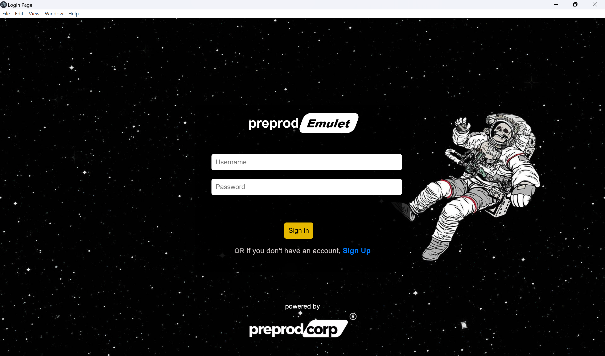
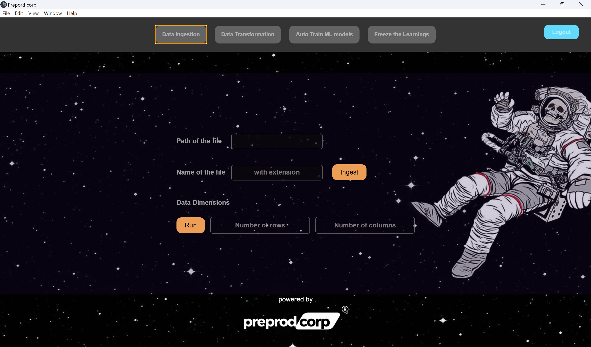
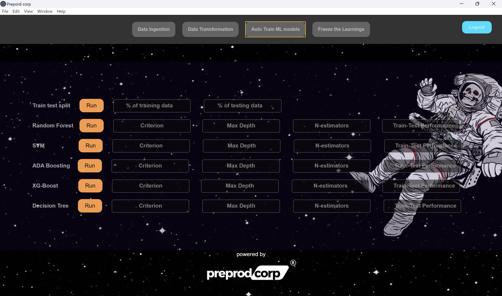
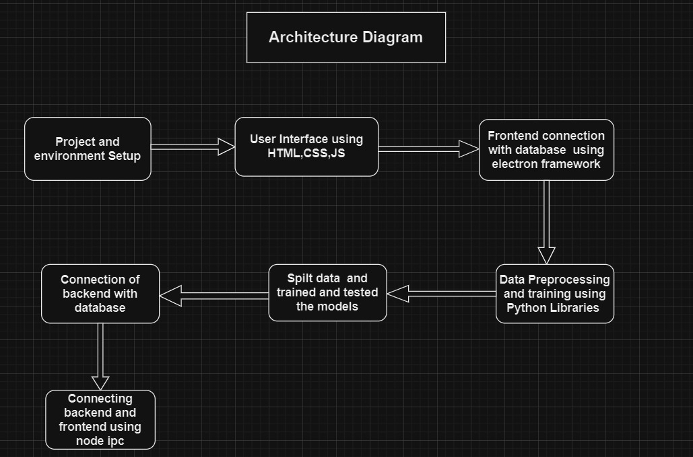

# AutoML UI

This project is part of a BUILDATHON to design and deploy a freely available UI that can train AIML models using any qualifying dataset, build an AutoML tool, and provide pickled files of trained AIML models. This document provides an overview of the project structure and implementation details.

## Table of Contents

- [Project Description]
- [Features]
- [Tech Stack]
- [Overview]
- [Architecture Design]
- [Installation]
- [Frontend Development]
- [Backend Development]
  - [Data Preprocessing]
  - [Data Splitting]
  - [Model Training]
  - [Connecting Frontend with Database]
  - [Connecting Backend with Database]
  - [Connecting Frontend and Backend]
  
- [Future Work]
- [Contributors]

## Project Description

AutoML UI is a desktop application developed using Electron and Visual Studio Code. The application allows users to train machine learning models using their datasets, apply AutoML techniques, and generate pickled files of the trained models.

## Features

- User-friendly interface for loading datasets and training models
- Data preprocessing and visualization tools
- Automated model training and evaluation
- Export trained models as pickled files

## Tech Stack

- *Frontend:* HTML, CSS, JavaScript, Electron
- *Backend:* Python, Electron, Node.js, Express.js
- *Database:* PostgreSQL 

## Installation

1. Clone the repository:
     bash
    git clone https://github.com/HJ2207/Buildathon_CodeCrafters.git
    
   
2. Installing the dependencies:
    bash
    npm install
    
   
3. Run the application:
     bash
    npm start
    
## Overview

## Architecture Design

## Frontend Development

The frontend is built using Electron, HTML, CSS, and JavaScript. It provides an interface for users to upload datasets, preprocess data, train models, and export the trained models. Front-end design, noted for its clean and intuitive user interface was achieved through a meticulous approach using only HTML, CSS, and JavaScript. Below, we outline the key components of our front-end development process.

## Key Components

- *index.html:* The main HTML file that serves as the entry point for the application.
- *css folder* The CSS file for styling the application.
- *main.js:* The main JavaScript file that initializes the Electron app.
- *renderer.js:* The JavaScript file that handles the frontend logic.
- *scripts.js:* The javascript files for functionality of the application

## Backend
    - Data Preprocessing
        The data preprocessing module handles tasks such as cleaning the data, handling missing values, and feature engineering. Once the data is preprocessed, it is used for training machine learning models.

    - Data Splitting
        The data splitting module handles splitting the data into training and testing sets.

    
    - Training and Testing the Model
        Once the data is split, the training and testing of the model are carried out. The model is trained on the training set and evaluated on the testing set.

    - Connecting Frontend with Database 
        In an Electron application, the frontend communicates with the backend using Node IPC (Inter-Process Communication). The backend can then perform database operations using an ORM like PostgreSQL and return the results to the frontend.

    - Connecting Backend with Database
        The backend connects to a database to store and retrieve data as needed. PostgreSQL is used for ORM to interact with the database.

    - Connecting Frontend and Backend
        Inter-process communication (IPC) is used to connect the backend with the frontend in an Electron application. This allows the frontend to send data to the backend for processing and receive results.

## Future Work
    - Pending Task: Connect the backend with the frontend.
    - Enhance the data visualization features.
    - Add support for additional machine learning algorithms.

## Contributors

- **Khushboo Mittal**: Led the **front-end development** and design of the sleek, elegant, and intuitive **user interface** along with **documentation**
                       [Github Profile](https://github.com/Khushboo-Mittal)
                       
- **Tanisha Priya**: Led the **front-end development** and design of the sleek, elegant, and intuitive **user interface** along with **documentation**
                       [Github Profile](https://github.com/Tanishapr)

- **Prachi Tavse**: Managed the **backend** and **Machine Learning**, ensuring robust functionality.
                       [Github Profile](https://github.com/prachitavse)

- **Harshita Jangde**: Managed the **backend** and **database integration**, ensuring robust functionality along with **documentation**.
                       [Github Profile](https://github.com/HJ2207)
